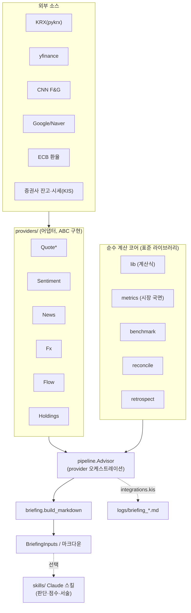

# stockbrief — 아키텍처

다른 개발자나 AI가 구조를 파악하고 안전하게 고치거나 확장할 수 있도록 쓴 문서입니다. 사용법은 [docs/USAGE.md](docs/USAGE.md), 용어는 [README](README.md)의 "핵심 개념"에 있습니다.

---

## 1. 설계 원칙

1. **데이터 소스 교체 구조(provider 패턴)** — 모든 외부 의존(보유·시세·심리·뉴스·환율·수급)을 인터페이스(추상 클래스) 뒤에 둡니다. 쓰는 쪽은 필요한 provider만 넘기고, 넘기지 않은 것은 자동으로 건너뜁니다. 키가 없는 무료 기본 구현이 있고, 정밀한 소스(KIS·네이버)로 갈아끼울 수 있습니다.
2. **계산과 판단 분리** — 비중·국면·종목 점수·회고처럼 숫자로 떨어지는 계산은 **순수 함수**(표준 라이브러리만 사용)로 둡니다. 사고팔지에 대한 **판단과 서술**은 코드가 아니라 함께 제공하는 **Claude 스킬**이 맡습니다.
3. **키 0개 우선** — 무료 기본 provider(pykrx·yfinance·CNN·구글·ECB)만으로 전체 브리핑이 나옵니다. API 키는 정밀도를 높이는 선택지입니다.
4. **보유 종목 주입** — 보유는 고정 파일이 아니라 쓰는 쪽이 넣습니다. 패키지는 특정 증권사나 파일 형식에 묶이지 않습니다.

> 수정할 때 먼저 던질 질문: **"순수 계산인가, 판단인가, 데이터 소스인가?"**
> 계산이면 `lib`·`metrics`·`benchmark`·`reconcile`·`retrospect`(+테스트), 데이터 소스면 `providers/`, 판단이면 `skills/`에 둡니다.

---

## 2. 레이어



- `indicators`(pandas)는 시세 provider가 OHLCV로부터 RSI·이동평균·52주 위치를 뽑을 때 공통으로 씁니다.
- `config.AdvisorConfig`는 설정 목록(regions·themes·news_queries·thresholds)을 코어와 파이프라인에 공급합니다.

---

## 3. 모듈 지도

```
src/stockbrief/
  lib.py          # 순수 계산식: 평균 매수가 역산·비중·과열도·심리 밴드·자체 추정 심리·시장 국면·종목 점수·회고 %
  indicators.py   # OHLCV → RSI14·이동평균(정/역배열)·52주 위치 (pandas)
  metrics.py      # all_regions(시장별 독립 국면)·flow_score
  benchmark.py    # my_value(라이브 재계산)·resolve_fx·excess_pct(초과 수익)
  reconcile.py    # 보유 변화 비교 → 거래 복원 + 순현금흐름
  retrospect.py   # 단순 보유 대비 매매 후 성과 % 평가
  config.py       # AdvisorConfig (dict/yaml 로드, 기본값 폴백)
  models.py       # Position·Holdings·Quote·NewsItem (정규화한 데이터 계약)
  pipeline.py     # Advisor(provider를 묶어 run()) → BriefingInputs
  briefing.py     # build_markdown(BriefingInputs) → 마크다운
  providers/
    base.py       # 추상 클래스: Holdings/Quote/Sentiment/News/Fx/Flow Provider
    holdings_json.py · holdings_dict.py
    quotes_pykrx.py · quotes_yf.py · quotes_kis.py · quotes_composite.py
    sentiment_cnn.py · news_google.py · news_naver.py · fx_free.py · flow_kis.py
  integrations/
    kis.py        # 한국투자증권(KIS) 어댑터 + build_briefing
skills/           # Claude 스킬(portfolio-advisor·retrospect)
examples/ · tests/
```

의존성 방향: `providers → models/indicators/lib`, `metrics/benchmark/reconcile/retrospect → lib`, `pipeline → config/metrics/lib/providers(base)`, `briefing → (BriefingInputs)`, `integrations → pipeline/briefing/providers`.
**불변식: 코어는 providers를 import하지 않습니다**(의존은 한 방향뿐).

---

## 4. 데이터 계약 (models.py)

```python
Position  = key · name · market("KR"|"US") · region · qty · avg_price_krw · currency · [eval_amount · profit_pct]
Holdings  = positions: list[Position] · cash? · trades?
Quote     = key · price · prev · rate · rsi14 · ma · ma_align · w52_high · w52_low · w52_pos_pct
NewsItem  = date(YYYY-MM-DD) · title · url · source
```
- `Position.as_holding_dict()`와 `Quote.as_dict()`가 lib·metrics가 받는 평범한 dict로 바꿔 줍니다. 덕분에 **lib는 순수(표준 라이브러리)하게 유지**되고, 기존 holdings.json 형식과도 호환됩니다.
- `pipeline.BriefingInputs` = holdings·tradable·quotes·fx·sentiment·flow·regions·weights·overheat·total_eval·news.

---

## 5. provider 인터페이스 (base.py)

| 추상 클래스 | 메서드 | 기본 구현(키 0개) | 정밀 옵션 |
|---|---|---|---|
| HoldingsProvider | `holdings() -> Holdings` | Json · Dict | KIS(잔고 API) |
| QuoteProvider | `quotes(keys, markets) -> {key: Quote}` | pykrx · yfinance · Composite | KIS |
| SentimentProvider | `score(region) -> float\|None` | CNN(미국) | — |
| NewsProvider | `search(query, days, asof) -> [NewsItem]` | Google | Naver |
| FxProvider | `usdkrw() -> float\|None` | frankfurter/ECB | — |
| FlowProvider | `kospi_flows(days) -> dict` | — | KIS |

**없으면 건너뜀**: provider를 넘기지 않으면 Advisor가 그 단계를 건너뜁니다. 국면은 보유·추세만으로 제한 판정하고, 환율이 없으면 평가액은 입력값을 그대로 쓰며, 뉴스는 생략합니다.

---

## 6. 도메인 모델 — region ≠ market

- `market`(상장 시장 KR/US): 시세를 조회하고 환율을 환산하는 기준입니다.
- `region`(기반 시장 US/KR/JP/CN/global): 시장 국면과 투자 심리를 판정하는 기준입니다.
- 시장 국면은 region마다 **독립**으로 판정합니다(`metrics.all_regions` → region별 `lib.region_regime`). 시장끼리 서로 덮어쓰지 않습니다.
- 투자 심리: `regions[r].sentiment == "cnn_fng"`인 시장은 CNN 점수를 쓰고, 그렇지 않으면 `trend_proxy` 지표로 자체 추정합니다.

---

## 7. 확장 지점

- **시장 추가**: `config.regions`에 `{trend_proxy, [sentiment], flag}` 한 줄을 더하고, 보유 종목에 `region` 태그를 붙입니다. 코드 수정은 없습니다.
- **시세 소스 추가**: `QuoteProvider`를 구현해 `quotes()`가 `{key: Quote}`를 돌려주게 하고, `CompositeQuoteProvider`에 market별로 끼웁니다.
- **증권사 보유 연동**: `HoldingsProvider`를 구현해 `holdings()`가 정규화한 `Holdings`를 돌려주게 합니다. 예: `integrations/kis.KisHoldingsProvider`.
- **투자 심리 소스 추가(예: 한국 심리 지수)**: `SentimentProvider`를 구현하고, `regions[r].sentiment` 키를 맞춘 뒤 `metrics.all_regions`의 심리 분기를 넓힙니다.
- **새 통합(다른 봇·대시보드)**: `integrations/<이름>.py`에 어댑터와 `build_*_briefing` 한 줄 함수를 둡니다.

---

## 8. 결정성 · 테스트 · 프라이버시

- 순수 계산 함수는 입력이 같으면 출력도 같습니다. `tests/`(pytest)의 `test_lib`·`test_providers`·`test_compute`는 **합성 데이터만** 씁니다.
- 네트워크 provider는 실패하면 빈 결과나 폴백을 돌려줍니다(예외로 파이프라인을 멈추지 않습니다). 선택 의존성은 **필요할 때만 import**하므로, 해당 의존성이 없어도 모듈 import는 됩니다.
- **개인정보 0**: 저장소에 실제 보유·계좌·키가 없습니다. `.gitignore`가 `secrets/ state/ logs/ *.enc holdings*.json benchmark*.json`을 막습니다. 예시와 테스트는 모두 합성입니다.

---

## 9. 한계

- 무료 시세(pykrx·yfinance)는 지연되거나 장 막판 값이 다를 수 있습니다. 실시간 정밀도가 필요하면 KIS provider를 씁니다.
- 자체 추정 투자 심리는 공식 지수가 아니라 RSI·52주 위치·추세(+수급)를 합성한 값입니다.
- 판단(종목 점수·매수/매도)은 패키지가 하지 않습니다 — 스킬이나 LLM의 영역입니다.
