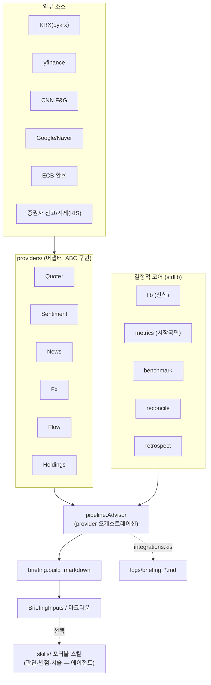

# stockbrief — 아키텍처

다른 개발자/AI 가 구조를 분석하고 안전하게 수정·확장할 수 있도록 쓴 문서. 사용법은 [docs/USAGE.md](docs/USAGE.md).

---

## 1. 설계 철학

1. **provider 패턴** — 모든 외부 의존(보유·시세·감성·뉴스·환율·수급)을 인터페이스(ABC) 뒤로 숨긴다. 소비자는 필요한 provider 만 주입; 없는 건 graceful skip. 키 없는 기본 구현 + 선택적 고정밀(KIS·네이버).
2. **결정적/판단 분리** — 산식(평단역산·비중·국면·별점·회고%)은 **순수 함수(stdlib)**. 매수/매도/유지 판단·서술은 코드가 아니라 **포터블 스킬(에이전트)** 이.
3. **키 0개 우선** — 기본 provider(pykrx·yfinance·CNN·Google·ECB)만으로 풀 브리핑이 나온다. 키는 정밀도 옵션.
4. **보유 주입** — 보유는 고정 파일이 아니라 소비 프로젝트가 넣는다. 패키지는 특정 증권사/포맷에 묶이지 않는다.

> 수정 시 첫 질문: **"결정적 산수인가, 판단인가, 데이터 소스인가?"**
> 산수 → `lib`/`metrics`/`benchmark`/`reconcile`/`retrospect`(+테스트). 소스 → `providers/`. 판단 → `skills/`.

---

## 2. 레이어



- `indicators`(pandas)는 시세 provider 가 OHLCV→RSI/MA/52주 산출에 공용으로 쓴다.
- `config.AdvisorConfig` 는 레지스트리(regions·themes·news_queries·thresholds)를 코어·파이프라인에 공급.

---

## 3. 모듈 맵

```
src/stockbrief/
  lib.py          # 순수 산식: 평단역산·비중·과열도·fng_band·computed_sentiment·region_regime·별점·회고%
  indicators.py   # OHLCV → RSI14·이동평균(정/역배열)·52주 위치 (pandas)
  metrics.py      # all_regions(시장별 독립 국면)·flow_score
  benchmark.py    # my_value(라이브 재계산)·resolve_fx·excess_pct
  reconcile.py    # 보유 diff → trades 복원 + 순현금흐름
  retrospect.py   # 단순보유 vs 매매후 % 평가
  config.py       # AdvisorConfig(dict/yaml 로드, 기본값 폴백)
  models.py       # Position·Holdings·Quote·NewsItem (정규화 데이터 계약)
  pipeline.py     # Advisor(provider 묶어 run()) → BriefingInputs
  briefing.py     # build_markdown(BriefingInputs) → 마크다운
  providers/
    base.py       # ABC: Holdings/Quote/Sentiment/News/Fx/Flow Provider
    holdings_json.py · holdings_dict.py
    quotes_pykrx.py · quotes_yf.py · quotes_kis.py · quotes_composite.py
    sentiment_cnn.py · news_google.py · news_naver.py · fx_free.py · flow_kis.py
  integrations/
    kis.py        # 한국투자증권(KIS) 어댑터 + build_briefing
skills/           # 포터블 Claude 스킬(portfolio-advisor·retrospect)
examples/ · tests/
```
의존성 방향: `providers → models/indicators/lib`, `metrics/benchmark/reconcile/retrospect → lib`, `pipeline → config/metrics/lib/providers(base)`, `briefing → (BriefingInputs)`, `integrations → pipeline/briefing/providers`. **코어는 providers 를 import 하지 않는다**(역방향만).

---

## 4. 데이터 계약 (models.py)

```python
Position  = key · name · market("KR"|"US") · region · qty · avg_price_krw · currency · [eval_amount · profit_pct]
Holdings  = positions: list[Position] · cash? · trades?
Quote     = key · price · prev · rate · rsi14 · ma · ma_align · w52_high · w52_low · w52_pos_pct
NewsItem  = date(YYYY-MM-DD) · title · url · source
```
- `Position.as_holding_dict()` / `Quote.as_dict()` 가 lib/metrics 가 먹는 plain dict 로 변환 → **lib 는 순수(stdlib)로 유지**되고 기존 holdings.json dict 와도 호환.
- `pipeline.BriefingInputs` = holdings·tradable·quotes·fx·sentiment·flow·regions·weights·overheat·total_eval·news.

---

## 5. provider 인터페이스 (base.py)

| ABC | 메서드 | 기본 구현(키0) | 선택 |
|---|---|---|---|
| HoldingsProvider | `holdings() -> Holdings` | Json·Dict | KIS(잔고 API) |
| QuoteProvider | `quotes(keys, markets) -> {key: Quote}` | pykrx·yfinance·Composite | KIS |
| SentimentProvider | `score(region) -> float\|None` | CNN(US) | — |
| NewsProvider | `search(query, days, asof) -> [NewsItem]` | Google | Naver |
| FxProvider | `usdkrw() -> float\|None` | frankfurter/ECB | — |
| FlowProvider | `kospi_flows(days) -> dict` | — | KIS |

**graceful degrade**: provider=None → Advisor 가 그 단계 skip(국면은 보유만/추세만, FX 없으면 eval 폴백, 뉴스 생략 등).

---

## 6. 도메인 모델 — region ≠ market

- `market`(상장지 KR/US): 시세 엔드포인트·환율 환산 대상.
- `region`(기반시장 US/KR/JP/CN/global): 시장 국면·감성 판정.
- 시장 국면은 region 마다 **독립**(`metrics.all_regions` → region별 `lib.region_regime`). 오버라이드 없음.
- 감성: `regions[r].sentiment == "cnn_fng"` 면 그 점수, 아니면 `trend_proxy` 지표로 `computed_sentiment` 추정.

---

## 7. 확장 지점 (Cookbook)

- **시장 추가**: `config.regions` 에 `{trend_proxy, [sentiment], flag}` 한 줄 + 보유에 `region` 태그. 코드 수정 0.
- **시세 소스 추가**: `QuoteProvider` 구현(`quotes()` 가 `{key: Quote}` 반환). `CompositeQuoteProvider` 에 market 별로 끼움.
- **증권사 보유 연동**: `HoldingsProvider` 구현(`holdings()` → 정규화 `Holdings`). 예: `integrations/kis.KisHoldingsProvider`.
- **감성 소스 추가(예: 한국 F&G)**: `SentimentProvider` 구현 + `regions[r].sentiment` 키 매칭 + `metrics.all_regions` 의 감성 분기 확장.
- **새 통합(다른 봇/대시보드)**: `integrations/<x>.py` 에 어댑터 + `build_*_briefing` 한 줄 함수.

---

## 8. 결정성·테스트·프라이버시

- 결정적 함수는 입력 같으면 출력 같다. `tests/`(pytest): `test_lib`·`test_providers`·`test_compute` — **합성 데이터만**.
- 네트워크 provider 는 실패 시 빈 결과/폴백(예외로 파이프라인 안 죽임). 선택 의존성은 **lazy import**(모듈 import 는 dep 없어도 됨).
- **개인정보 0**: 리포에 실보유·계좌·키 없음. `.gitignore` 가 `secrets/ state/ logs/ *.enc holdings*.json benchmark*.json` 차단. 예시·테스트는 합성.

---

## 9. 한계

- 무료 시세(pykrx/yfinance)는 지연·장막판 차이 가능 → 실시간 정밀은 KIS provider.
- `computed_sentiment` 는 공식 지수가 아닌 자체 합성(RSI·52주·추세+수급).
- 판단(별점·매수/매도)은 패키지가 안 한다 — 스킬/LLM 영역.
